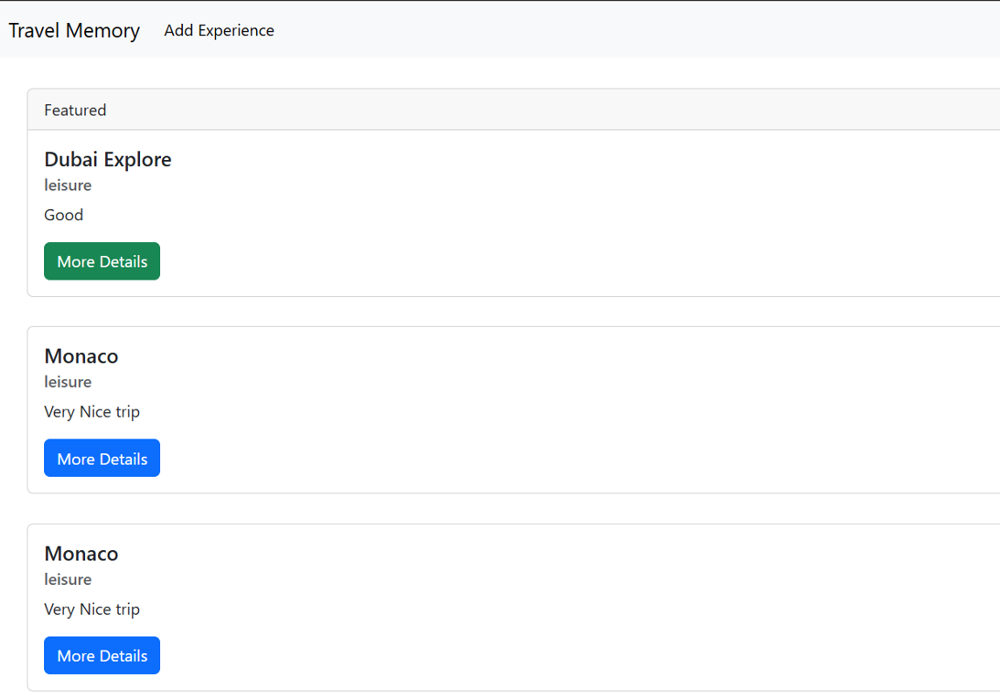

# Mern-Terraform-Ansible
To Gain practical experience in deploying a MERN stack application on AWS using infrastructure automation with Terraform and configuration management with Ansible.

## Implementation

### Part 1: Infrastructure Setup with Terraform
1. AWS Setup & Terraform Initialization
   -  Configure AWS CLI
   ```
     aws configure
   ```
   . Install Terraform if not already installed
   - Create a new Terraform project:
   ```
      mkdir terraform-infra && cd terraform-infra
   ```
   - Initialize Terraform
   ```
      terraform init
   ```
2. VPC, Network Configuration, EC2 Instance Provisioning, Security Groups & IAM Roles
   - [terraform/main.tf](terraform/main.tf)
3. Output of the public IP can obtained using [terraform/outputs.tf](terraform/output.tf)

### Part 2: Configuration and Deployment with Ansible
1. Install Ansible and required dependencies
   ```
      sudo apt update && sudo apt install -y ansible
   ```
2. Define the inventory file [ansible/inventory.ini](ansible/inventory.ini):
   ```
      [webserver]
      <WEB_SERVER_PUBLIC_IP> ansible_user=ubuntu ansible_ssh_private_key_file=~/.ssh/id_rsa

      [dbserver]
      <DB_SERVER_PRIVATE_IP> ansible_user=ubuntu ansible_ssh_private_key_file=~/.ssh/id_rsa
   ```
3. Setup webserver using [ansible/webserver.yaml](ansible/webserver.yaml)
4. Setup Database server using [ansible/dbserver.yaml](ansible/dbserver.yaml)
5. Setup the application deployment using [ansible/deploy.yaml](ansible/deploy.yaml)
6. Run ansible playbook using
   ```
      ansible-playbook -i inventory.ini deploy.yml
   ```

### Verification:
Verify the app is properly deployed
- 
